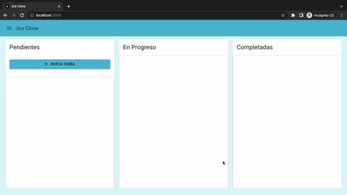

# Next.js Jira Clone

## Descripción
>### Aplicación realizada con Nextjs para aplicar conceptos de Server Side Rendering

## Gif
### Aplicación



## Levantar BD

- Ejecutar:

```
docker-compose up -d
```

- El -d significa **detached**, es decir, que el proceso no se detiene al finalizar

* Acceder a `mongodb://localhost:27017`

## Configurar variables de entorno

- Renombrar **.env.example** a **.env**

## Llenar base de datos con datos de prueba
- Ejecutar endpoint:
```
http://localhost:3001/api/seed
```

```

## Lo Aprendido
* Trabajar con Server Side Rendering
* Trabajar drag and drop de elementos
* Trabajar docker compose para levantar una base de datos
* Trabajar con conexiones a bases de datos desde Nextjs autilizando directorio api
* Trabajar con paquetes de notificaciones y fechas de publicacion
